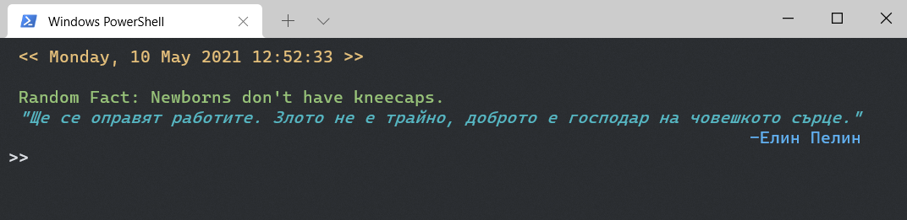

<h1 align='center'> powershell-startup </h1>
<div align='center'>

[](https://forthebadge.com)

<strong><<< Customize your Windows terminal >>></strong>

Displays a random interesting fact every time you open the terminal using web scraping with **Python** and **BeautifulSoup4**.
The fact is presented alongside with current data and time information and a motivational quote.



</div>

## Setup
1. Open up Windows PowerShell
2. Type in ```notepad $profile```
3. Paste these lines in Notepad (Replace the path to folder):
```
python <path-to-the-project-folder>\startup.py
function prompt {">> "}
```
4. Save and close
5. Start a new PowerShell

*Tip:* To remove the standard Windows message when starting PowerShell, run ```powershell.exe``` with the ```-nologo``` argument.
